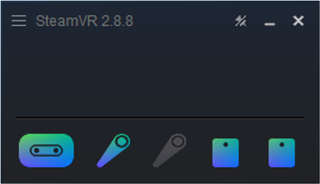
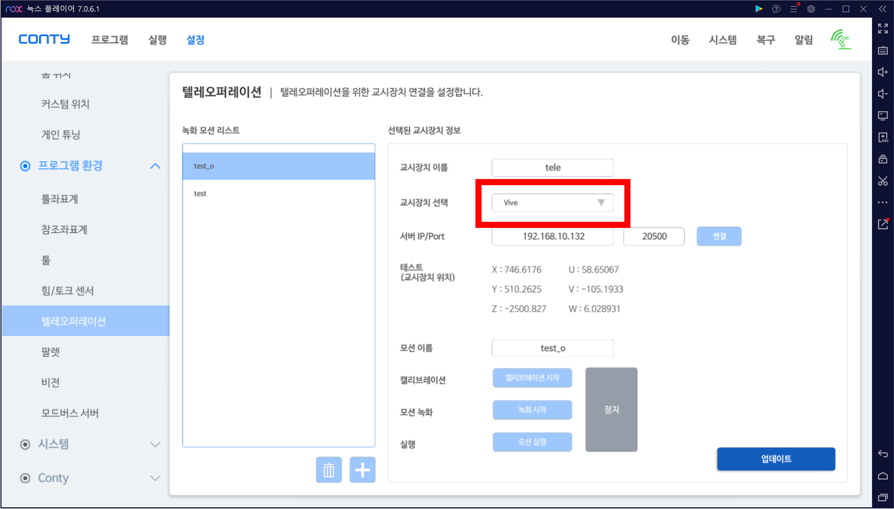
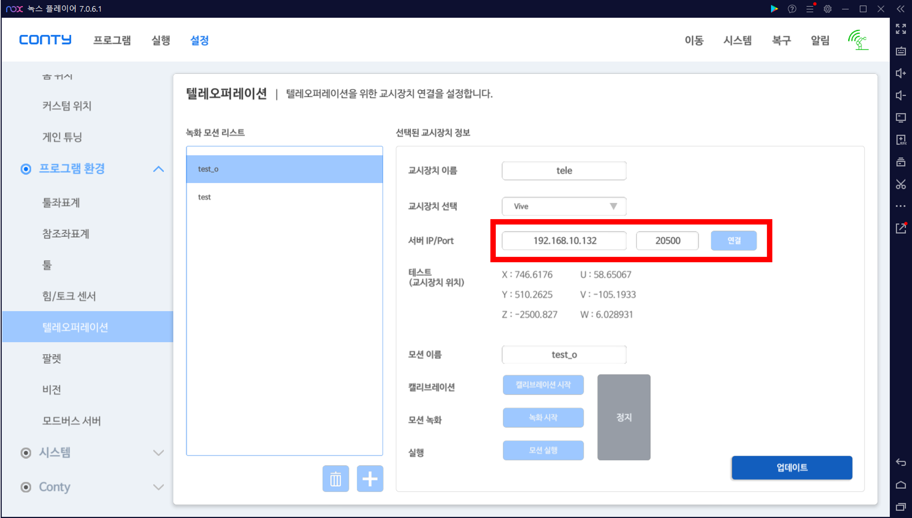
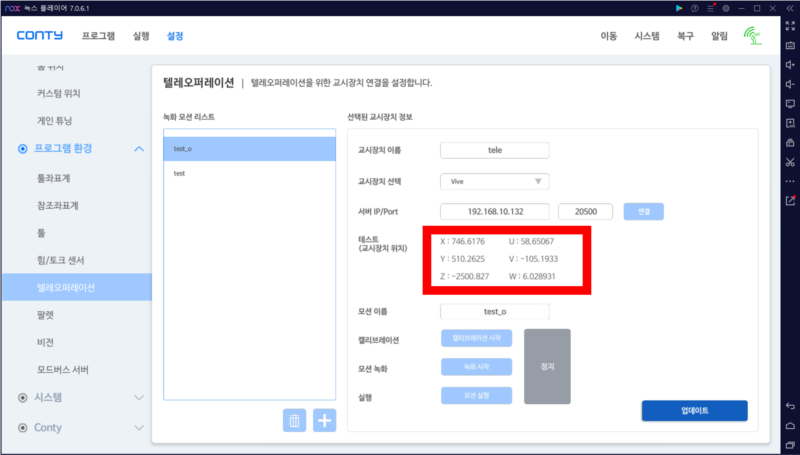
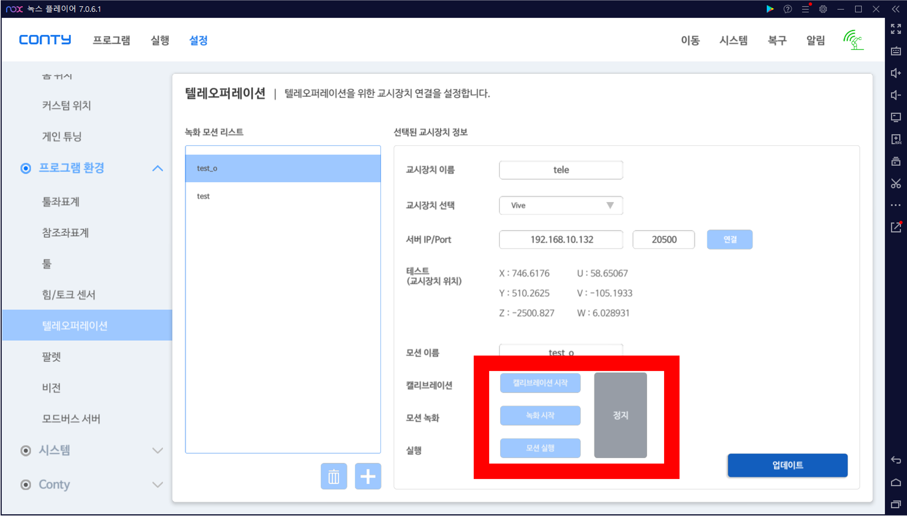
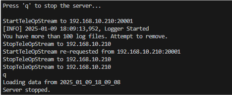
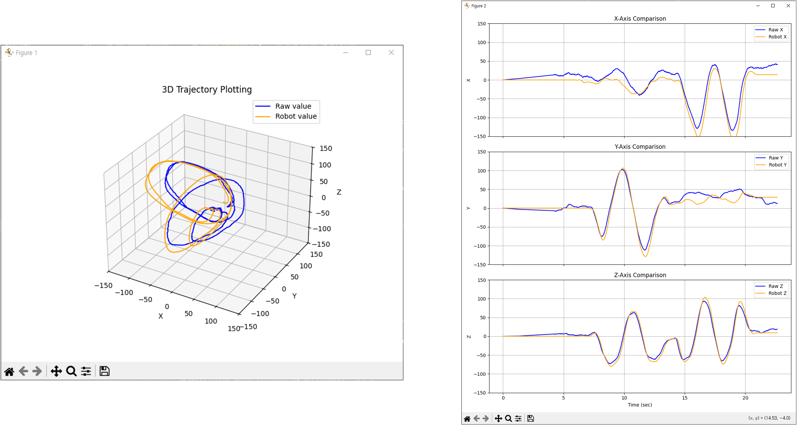
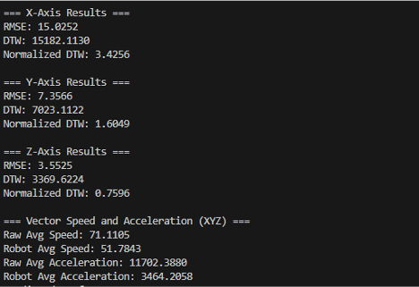

# **휴대폰 및 VIVE 기반 기술교시**

휴대폰 또는 VIVE 기반으로 기술교시를 진행하는 방법에 대한 안내입니다. 

---

## **1. 디바이스 세팅**

### **휴대폰**

1. **HelloAR Java 애플리케이션 실행**
    - 애플리케이션 상단에 **Server IP**를 입력 후 연결합니다.
    

### **VIVE**

1. **SteamVR 실행**
    - SteamVR에서 VIVE 장치가 정상적으로 켜져 있는지 확인합니다.
    
---

## **2. 서버 열기**

1. 터미널에서 다음 명령어를 실행합니다:
    
    ```bash
    python teleop_server.py
    ```
    
2. 서버가 실행되며 **Server IP**가 출력됩니다.
3. 서버에서 다음 항목을 설정합니다:
    - **디바이스 선택**: 휴대폰 또는 VIVE
    - **데이터 저장 여부**: 저장할지 선택

---

## **3. Conty 연결**

1. **Conty를 로봇과 연결**합니다.
2. **설정** → **프로그램 환경** → **텔레오퍼레이션** 메뉴를 엽니다.
3. **교시장치**를 **Vive**로 선택합니다.
    
    
4. **Server IP**와 **Port 번호**를 입력한 후, 서버와 연결합니다.
    
    
5. **테스트**: 교시장치의 위치 값을 확인하여 데이터가 변하는지 확인합니다.

    

## **4. 기술 교시**



### **캘리브레이션**
- **캘리브레이션 시작** 버튼을 클릭하여 설정을 완료합니다.

### **녹화 시작**

- **녹화 시작** 버튼을 눌러 기술교시를 시작합니다.

- **스마트폰**

    - **Enable** 버튼이 **파란색**이면 녹화 중, **회색** 버튼이 되면 일시 정지 상태입니다.
    - 카메라가 가려지거나 서버와의 연결이 해제되면 녹화가 중단됩니다.

- **VIVE**

    - **메뉴 버튼**을 누르고 있는 동안 녹화가 진행되며, 버튼을 떼면 녹화가 일시 정지됩니다.

### **모션 실행**
- **저장된 모션**을 로봇에서 실행할 수 있습니다.

---

## **5. 저장된 데이터 분석 및 시각화**

### **서버 종료**

- **터미널에서 'q'를 입력**하여 서버를 종료합니다.
    


### **그래프 시각화**
- 시각화는 다음 항목을 포함합니다:
    - **경로 그래프**: x, y, z 위치의 3D 이동 경로
    - **시간에 따른 위치 변화**: x, y, z의 position 그래프
        - **파란색**: 로봇 위치 값
        - **주황색**: 디바이스 입력 값
- 데이터 시각화를 통해 경로와 위치 변화의 차이를 확인할 수 있습니다.



### **정량적 분석**

- 정량적 분석 결과는 아래 값을 포함합니다:
    1. **x, y, z 위치 값에 대한 RMSE, DTW, Normalized DTW 값**
    2. **위치 벡터의 평균 속도 및 가속도**
    - 디바이스 입력 값과 로봇 위치 값을 대조하여 출력됩니다.

    

---

## **참고사항**

- 모든 작업은 서버가 정상적으로 실행되고 디바이스가 연결된 상태에서 이루어져야 합니다.
- 데이터 저장 옵션을 선택하지 않으면 분석 및 시각화가 진행되지 않습니다.

---